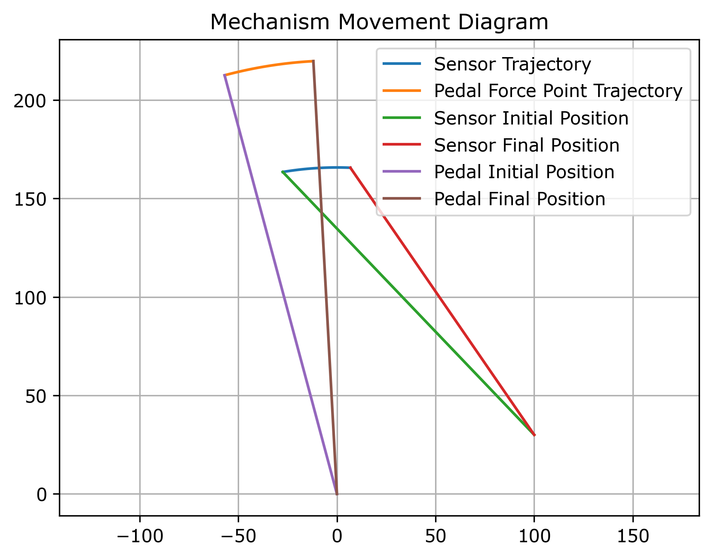
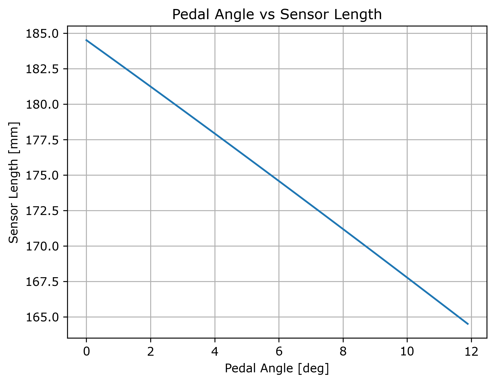
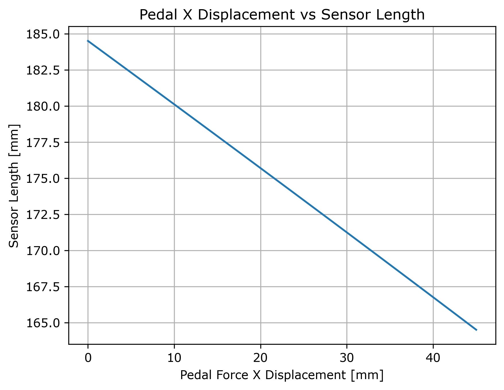
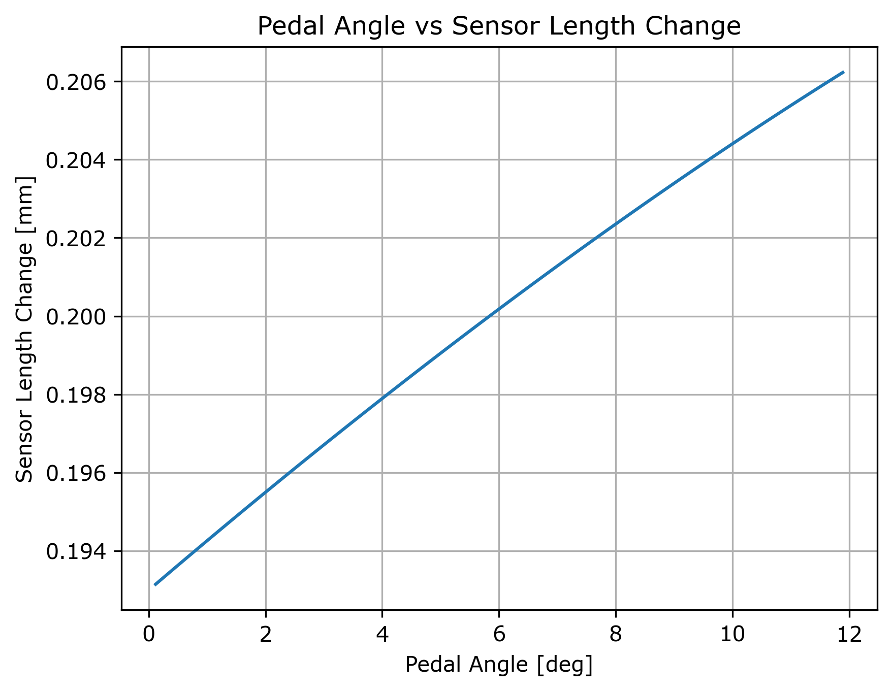
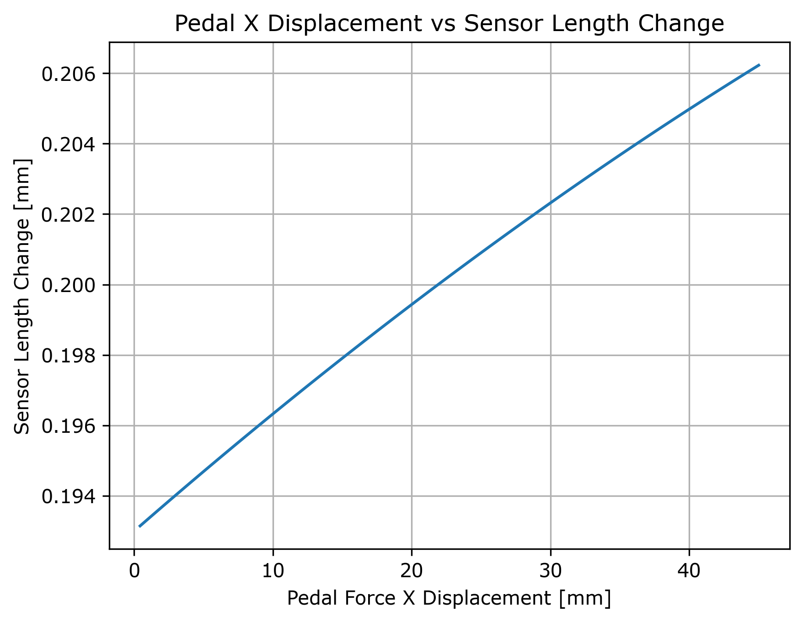

# 踏板–Sensor 運動學分析

>本文件展示了踏板機構與線性位移感測器的運動學分析。
文件中所有圖表皆由 Python 模擬腳本 **自動生成**，請不要更改。

## 1. 問題描述

本分析的目的是研究踏板運動與感測器響應之間的幾何關係。

分析評估的物理量包括：

- 踏板旋轉角度
- 踏板施力點位移
- 線性感測器長度
- 感測器長度增量變化

踏板圍繞固定軸旋轉，而感測器由以下部分組成：
- 固定端點安裝於車體
- 移動端點連接踏板連桿

此配置可代表車輛控制系統中常用的踏板位置感測機構。

## 2. 座標系與假設

分析基於以下假設：

- 運動限制在二維平面 (X–Y 平面)
- 踏板繞 Z 軸旋轉
- 假設剛體運動學
- 感測器長度定義為兩端點之歐氏距離

採用標準右手笛卡爾座標系。

## 3. 踏板旋轉模型

踏板旋轉可用 Z 軸旋轉矩陣表示：

$$
\mathbf{R}_z(\theta) =
\begin{bmatrix}
\cos\theta & \sin\theta & 0 \\
-\sin\theta & \cos\theta & 0 \\
0 & 0 & 1
\end{bmatrix}
$$

給定踏板上的初始點（局部座標表示）：

$$
\mathbf{p}_0 =
\begin{bmatrix}
x_0 \\
y_0 \\
1
\end{bmatrix}
$$

則踏板角度 $\theta$ 時的旋轉位置為：

$$
\mathbf{p}(\theta) = \mathbf{R}_z(\theta)\,\mathbf{p}_0
$$

此公式可應用於：
- 踏板施力點
- 踏板上的感測器連接點

## 4. 感測器長度計算

感測器長度定義為兩端點之間距離：

- 固定感測器錨點
- 移動感測器連接點

固定感測器錨點為：

$$
\mathbf{s}_f =
\begin{bmatrix}
x_f \\
y_f
\end{bmatrix}
$$

移動感測器連接點為：

$$
\mathbf{s}_m(\theta) =
\begin{bmatrix}
x_m(\theta) \\
y_m(\theta)
\end{bmatrix}
$$

感測器長度計算公式：

$$
L(\theta) =
\sqrt{
\left(x_f - x_m(\theta)\right)^2 +
\left(y_f - y_m(\theta)\right)^2
}
$$

## 5. 感測器長度增量變化

為了評估感測器靈敏度，感測器長度的增量變化計算為：

$$
\Delta L_i = L_{i-1} - L_i
$$

第一個資料點不計入，以避免初始化造成的零差異干擾。

## 6. 模擬流程

模擬步驟如下：

1. 定義踏板幾何與感測器安裝位置
2. 使用三角函數計算初始座標
3. 將踏板從零角度逐步旋轉到最大踏板角度
4. 每個旋轉步驟：
   - 更新踏板施力點位置
   - 更新感測器連接點位置
   - 計算感測器長度
5. 後處理記錄資料以獲得感測器長度增量變化

## 7. 產生結果

### 7.1 機構運動圖



此圖顯示機構的運動學軌跡，包括：

- 踏板施力點軌跡
- 感測器連接點軌跡
- 初始與最終構型

圖表可用於驗證運動學模型的幾何正確性。

### 7.2 踏板角度 vs 感測器長度



此圖顯示踏板旋轉角度與感測器長度的關係。
觀察到的非線性完全源自幾何約束。

### 7.3 踏板 X 位移 vs 感測器長度



將感測器長度繪製對踏板施力點水平位移。
當踏板輸入以線性位移描述時，此圖表特別有用。

### 7.4 踏板角度 vs 感測器長度增量



此圖展示感測器長度增量隨踏板角度變化。
可直接觀察感測器對角度輸入的靈敏度。

### 7.5 踏板 X 位移 vs 感測器長度增量



此圖將踏板位移直接對應於感測器增量響應。
可用於評估：

- 機械優勢
- 感測器解析度
- 感測機構線性程度

## 8. 機構分析

直接複製貼上以下程式內容即可直接產生機構動畫，可以模擬到踏板機構實際運作狀況

```python
from vpython import *
import numpy as np

# 工具
def rotate(point, center, theta):
    R = np.array([
        [np.cos(theta), -np.sin(theta), 0],
        [np.sin(theta),  np.cos(theta), 0],
        [0,              0,             1]])
    return center + R @ (point - center)

# =========================(場景設定)
scene = canvas(title="Triangular Pedal with Linear Sensor",
               width=900, height=600,
               center=vector(0,120,0),
               background=color.white)

# =========================(幾何定義)
P0 = np.array([0, 0, 0])          # 踏板旋轉中心
P1_0 = np.array([0, 220, 0])      # 腳踩點
P2_0 = np.array([60, 160, 0])     # Sensor 接點

sensor_base = np.array([80, 40, 0])

# =========================(視覺物件)
pivot = sphere(pos=vector(*P0), radius=6, color=color.black)

pedal_01 = cylinder(radius=4, color=color.blue)
pedal_12 = cylinder(radius=4, color=color.blue)
pedal_20 = cylinder(radius=4, color=color.blue)

foot_point = sphere(radius=6, color=color.red)
sensor_tip = sphere(radius=5, color=color.green)

sensor_base_vis = sphere(pos=vector(*sensor_base), radius=5, color=color.black)
sensor_rod = cylinder(radius=3, color=color.green)

# =========================(動畫)
theta = np.deg2rad(0)
theta_max = np.deg2rad(12)

while True:
    rate(30)

    theta += np.deg2rad(0.25)
    if theta > theta_max:
        theta = 0

    # 旋轉踏板三角形
    P1 = rotate(P1_0, P0, -theta)
    P2 = rotate(P2_0, P0, -theta)

    # 更新踏板邊
    pedal_01.pos = vector(*P0)
    pedal_01.axis = vector(*(P1 - P0))

    pedal_12.pos = vector(*P1)
    pedal_12.axis = vector(*(P2 - P1))

    pedal_20.pos = vector(*P2)
    pedal_20.axis = vector(*(P0 - P2))

    # 腳踩點
    foot_point.pos = vector(*P1)

    # Sensor
    sensor_vec = P2 - sensor_base
    sensor_rod.pos = vector(*sensor_base)
    sensor_rod.axis = vector(*sensor_vec)
    sensor_tip.pos = vector(*P2)
```