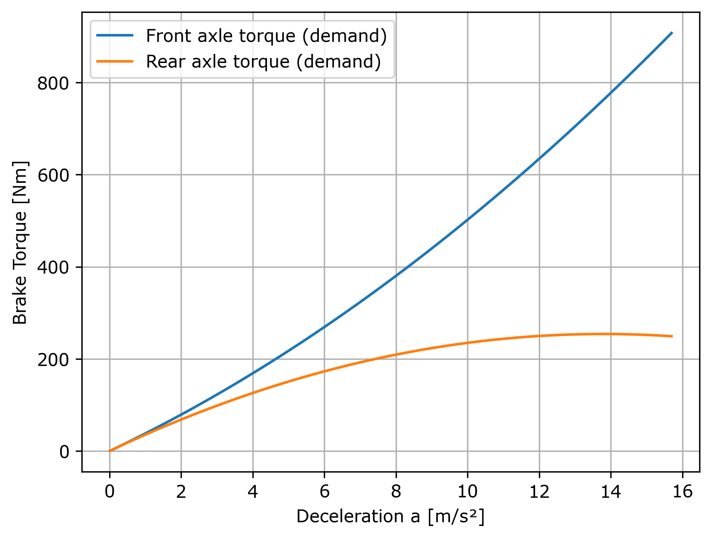
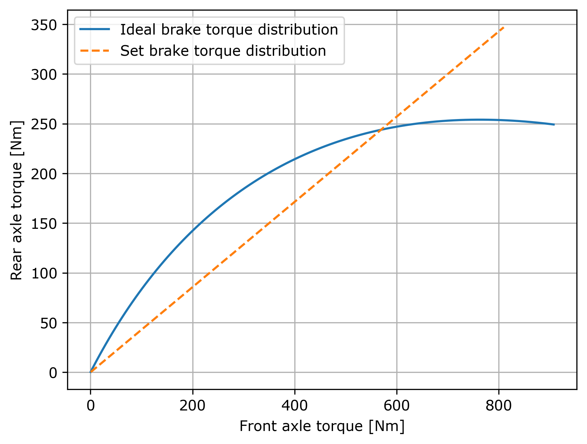

# Pedal ratio
[Pedal_ratio](Pedal_ratio.m)
## 力平衡

$$\sum F_y = 0$$

$$mg = N_{f}+N_{r}$$

$$\sum M = 0$$

$$l_fmg = lN_{f_s}$$

$$\Delta_m = mah_{cog}/l$$

$$N_f = N_{f_s}+\Delta_m$$

$$N_r = N_{r_s}+\Delta_m$$

## 摩擦力

$$f = \mu N$$

$$F_{max} = ma_{max} = f_{f_{max}}+f_{r_{max}}$$

$$ma_{max} = \mu_w N = \mu_w mg$$

$$a_{max} = \mu_w g$$

$$f_{f_{max}} = \mu_wN_f$$

$$f_{r_{max}} = \mu_wN_r$$

$$M_{a} = fr_w$$

$$M_{fw} = M_{fa}/2$$

$$M_{rw} = M_{ra}/2$$

## 計算煞車比

$$M_{fw}/(M_{fw}+M_{rw})$$

$$M_{rw}/(M_{fw}+M_{rw})$$

## 計算 Pedal ratio ( $PR$ )

$$r_{disc}  = r_{disc_o}/2-d_{gap}$$

$$M_{w} = r_{disc}F_{disc}$$

因為來令片左右兩側對夾所以摩擦力乘以2
$$F_{disc} = 2\mu_{pad}F_{caliper}$$

$$F_{caliper} = F_{disc}/(2\mu_{pad})$$

$$P = F_{caliper}/A_{caliper}$$

$$A = \pi (D/2)^2$$

計算完成後我們可以得出以下結果

$$F_{mc} = PA_{mc}$$

$$PR = (F_{mc_f}+F_{mc_r})/F_{driver} = 1.661$$

## balance bar

### 前後軸煞車扭矩需求

用0~最大加速度和所需的前後煞車扭矩作圖，畫出兩條曲線，觀察前後煞車扭矩變化

### 煞車比例比較（Ideal vs Balance Bar）

並將0~最大加速度時前後的煞車比與選用的balance bar比例進行比較作圖，從此分析選用比例是否合適。

